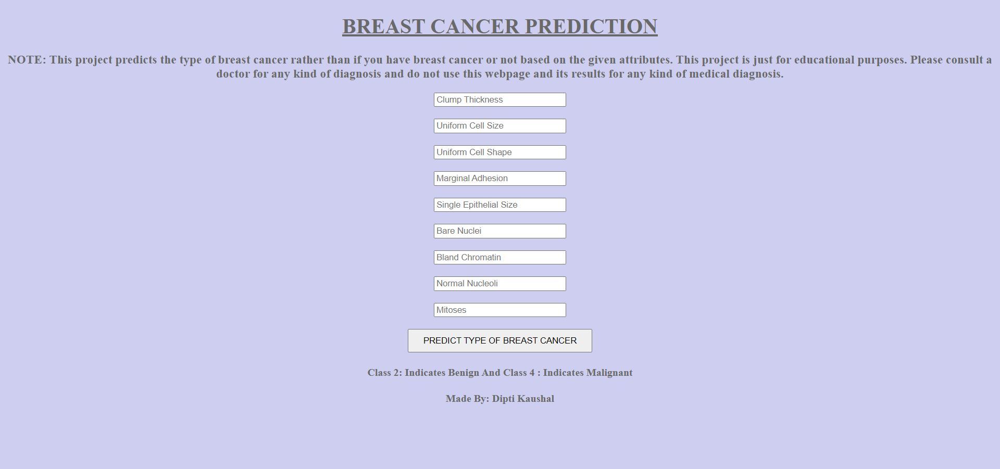
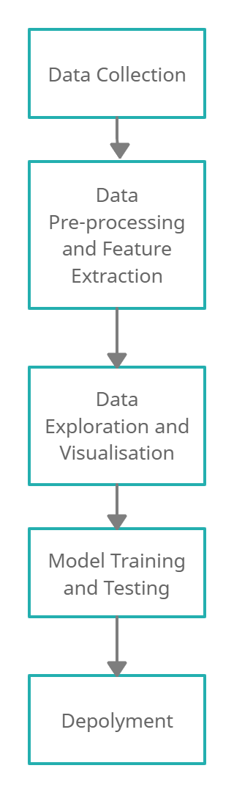

# Breast Cancer Predicition

## NOTE: This project predicts the type of breast cancer rather than if you have breast cancer or not based on the given attributes. This project is just for educational purposes. Please consult a doctor for any kind of diagnosis and do not use this webpage and its results for any kind of medical diagnosis.

This is a web application designed to show the project structure for a machine learning model deployed using flask. This project features a machine learning model that has been trained to detect whether the given values determines the cancer to be Benign (Class-2) or Malignant(Class-4). This application acts as an interface for a user to submit attributes for prediction of the type of cancer and not whether the person has breast cancer or not.
The accuracy obtained is 0.96 after training of the model.

## Technology Used:
* Python, Flask, HTML, CSS, Heroku

You can find the deployed page at https://cancer-predict-dipti-101803601.herokuapp.com/

## Methodology

## Novelty
1. Considered all the nine factors (clump thickness, uniform cell size, uniform cell shape, marginal adhesion, single epithelial size, bare nuclei, bland chromatin, normal nucleoli, mitoses) present in the dataset for training and testing of models.
2. Compared performance of various models and selected *K-Nearest Neighbour* as the best model with accuracy of 0.96.
